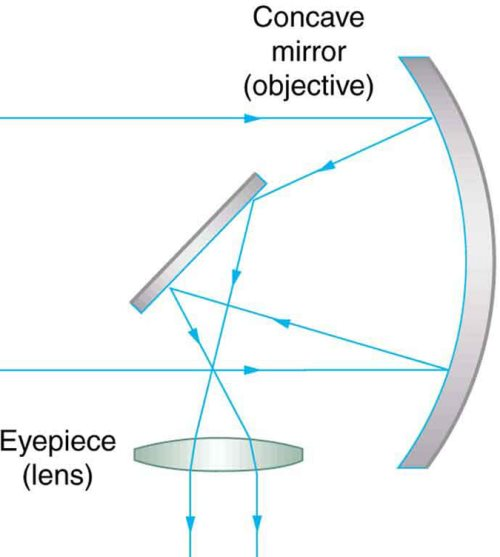

# Remmi

_Go away! Nothing to see here yet_

_Materialized views for immutable data_

Remmi is a fresh take on data flow and state management by very explitly deliniating the concepts of [values and identities](https://www.youtube.com/watch?v=Gyp2QDr7YkU).
Basically it is a weird mix of the concepts of lenses, streams and goodies from mobx like glitch free derivation graphs (and optionally transparent tracking).

Conceptually Remmi allows you to build a set of lenses and prismas.
One can create an unlimited amount and complex trees of lenses, but in the end they reflect just different views on one central, immutable value: the state of the store.



Lenses and immutable stores are no new concepts, but Immer adds a few fresh concepts to the list:

* Updates are very straight forward to apply tnx to [immer](https://github.com/mweststrate/immer)
* Lenses act as two-way pipes; one can write to a lens and the lens will transparently apply the changes to the original root store. This makes it possible to decouple and isolate small parts of the state and makes asynchronous process easy
* Lenses and stores share exactly the same api, which has great benefits for test
* Remmi applies efficient, glitch-free derivation concept from MobX, which makes it impossible to observe stale or inconsistent data
* All actions and derivations in Remmi are synchronous and transactional
* Remmi supports the concepts of models; this makes it possible to design very friendly APIs around a particular lens and organize the code base by-feature
* Remmi has first class integration with React. Render are optimized without needing further optimizations such as `shouldComponentUpdate`
* Remmi optionally supports transparent tracking of dependencies, avoiding the need to set up explicit subscriptions
* Remmi supports forking, cloning, replay of actions, patches and all that fancy stuff

Is it better than MobX? Well, that is not mine to decide :-). But my initial guess: No. And so far this is just an experimental package. It is less efficient and syntactically more verbose. However if you prefer a single-immutable-value-source of truth, with less magic. You might fancy this one.

# Core cencept

## Level 1: creating lenses

The most important concept in remmi is the concept of lenses.
Lenses allow creating materialized views on the state, and enables reading from, writing to, and reacting to changes in the materialized view.

To support these features every lens exposes the following three core methods:

1. `value()` returns the current, immutable value of the lens
2. `update(thing)` applies an update to the current lens; that is, transforms and propagetes the update to wherever the lens got it's value from. Thing can be one of the following things:
   * An [immer producer function](https://github.com/mweststrate/immer#api) where all changes that are made to the draft are applied to an immutable copy. This is the recommended way to update state
   * An object. Merges the provided object with the current object using `Object.assign`
   * A primitive value or array. Replaces the currenet state with the given value
3. `subscribe(handler)`. The handler will called automatically every time the `value` of this lens is changed

In immer, every store is a lens as well. So the simplest way to create a lens is to just create a fresh store.

```javascript
const profile$ = createStore({
      name: "Michel",
      address: {
            country: "Amsterdam"
      }
})

// subscribe
const disposer = profile$.subscribe(profile => {
      console.log(profile.address.country)
})

// update
profile$.update(draftProfile => {
      draftProfile.address.country = "The Netherlands"
})
// prints: "The Netherlands"

disposer() // cancel the subscription

// read the current value
console.log(profile$.value().address.country)
```


level 1b: field lenses (strongly typed!)

Level 2: subscribing

Level 3: merging lenses

level 4: with react

level 5: with react and di

Level 6: auto lenses (modern browsers only)

Level 7: redux compatibility?

level 8: models; views & actions?

level 9: patches

level 10: testing: stubbing lenses etc

---

Convenience api's
* directly pass values to update
* `select` builder or not
* multiple builders

---

Recipes

- simple example

- references

- testing a lens (model)

- async process


- connect to db

---

Gotchas

* optimize: don't create selectors inline
* don't accidentally return, like: `lens.update(x => x.y += 2)`

TODO

* [x] project setup
* [x] transactional
* [x] record / replay (fork / rebase) api's
* [x] readonly
* [ ] accurate typings
* [ ] separate bindings
* [ ] symbol supports (primitive, observable, json etc)
* [x] nice toStrings
* [ ] create store from externally stored state e.g. (`createStore(() => this.state, this.setState)`
* [ ] custom lens creating:
      * createLensType({ name: string, onCompute, onUpdate, onSuspend, chainable: true })
* [x] model api
* [x] log lens
* [ ] funny api?
* [ ] separate export for react bindings
* [ ] read only lens
* [ ] patch subscriptoin
* [ ] reflection: show lenses base tree; patches
* [ ] optimistic lens?
* [ ] from resource (at root or in tree) example
* [ ] example promise model
* [ ] merge toStream / fromStream support?
* [ ] fix all the tostrings